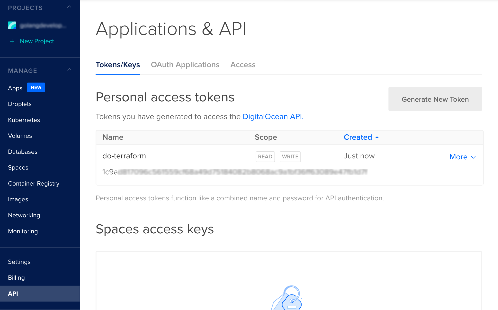

# Deploy

This repo is used to quickly deploy droplets on Digital Ocean.

Take note that some things were added to .gitignore, as they should remain secret and confidential, f.e. because they include credentials.


## TERRAFORM Usage 💡

0. [Install Terraform](https://learn.hashicorp.com/tutorials/terraform/install-cli) and cd to ./terra 📁 !
1. Create Digital Ocean API access key and add it to your env variables:

```bash
export DIGITALOCEAN_ACCESS_TOKEN= ...
```



2. Create private and public key:

```bash
ssh-keygen -t rsa -C "your_email@example.com" -f ./tf-digitalocean
```

3. Edit the config in main.tf and other files to your desire
4. Run (the apply will create "../ansible/hosts.cfg" file with droplet ip automatically):

```bash
terraform init
terraform apply
```

5. The desired droplets should be created.
6. To clean up your infrastructure, use:
   > terraform destroy

## Contribution

> Have a look at the code for how to update any of the deploys

# Made by

rojberr 👷‍♂️
