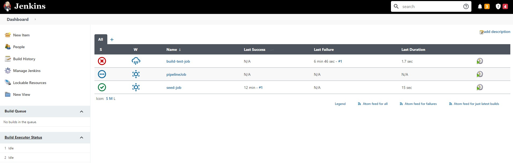

# preconfigured-jenkins

This Infrastructure as a Code repo builds Docker image and deploys preconfigured Jenkins container to build, test and deploy other projects!
~~An exemplary instance was deployed here :point_right: [http://207.154.196.96:8080/](http://207.154.196.96:8080/)~~ :feelsgood:
I use it daily to build and check my own GitHub code.


## Usage 💡

To use this CI/CD Infrastructure as Code repo:
- clone it,
```bash
git clone git@github.com:rojberr/preconfigured-jenkins.git
```
- build the Docker image,
```bash
docker build -t preconfigured-jenkins ./01-build-docker-image
```
- now either execute it locally:
```bash
docker run -p 8080:8080 -p 50000:50000 -v jenkins_home:/var/jenkins_home preconfigured-jenkins
```
- or push it and deploy it on your server ^^ ...
- log in as admin and enjoy your dockerized Jenkins for GitHub jobs 💕

## Configure up to your needs! ⚙️
- To install Jenkins plugins change the `Dockerfile` plugins section:
```bash
vim ./01-build-docker-image/Dockerfile
```
- To change Jenkins configuration edit Groovy scripts (all scripts will be copied to Docker image and executed on launch) located in:
```bash
cd ./01-build-docker-image/init.groovy.d
```
- To add/delete/modify Jenkins `jobs/pipelines` using JCasC Plugin modify `01-build-docker-image/custom-jenkins-config.yml`:
```bash
vim 01-build-docker-image/custom-jenkins-config.yml
```
- define admin login and password:
```bash
export JENKINS_ADMIN_ID=...
export JENKINS_ADMIN_PASSWORD=...
```

## Create jobs from remote Repos
To create jobs using files located in remote repos take a peek at `seedJob.xml` example in `./01-build-docker-image/remote-jobs`. Create `createJobs.groovy` and `pipelineJob.groovy` in your remote repo root folder.

The createJobs.groovy files will be used by Jenkins job DSL plugin to create build/test job.

## Need further support?

The code is provided as-is with no warranties.
Contact me if you want to contribute at rojberr@outlook.com .



## Things to automate - quick list:
INFRA:
- setting up the infra / server
- downloading Jenkins (jar/war) / or container hosted?
IMAGE:
- installation / first setup ✔️
- admin password setup ✔️
- unlocking Jenkins for the first time (token?) ✔️

- user creation (at least one for each: guest / dev / admin) with roles
- Jenkins master slave setup (one master and create one slave)
  (master - scheduling jobs, communicating and giving instr)
  (slave - execute jobs, takes cmds from master)
- configure global security for agents
- build pipelines (at least one for each project) -- branch out and create default and your conf
- schedule some nightly / periodic builds
- configure build triggers on git push
  (webhook and poll scm)
- delegate user database or include LDAP
- configure:
- set system message
- set # executors
- email notifications (use plugin extended e-mail notification)
- configure smtp (gmail? / docker mailserver)
-
- html reports after tests
docker run --name jenkins -d -p 9090:8080 --mount source?jenkins_data,target=/var/jenkins_home
or -v jenkins_data:/var/jenkins_home jenkins/jenkins:latest?
the the volume is under /var/lib/docker/volumes/
- add jenkinsfile to each project
- pipelines to build docker image from dockerfile and upload to dockerhub
  (add jenkins user to docker group usermode -a -G docker jenkins)
- multibranch jobs


--- OLD USAGE WITH GRADLE PLUGIN - deprecated ---
- build and run container:
```bash
./gradlew build docker dockerRun
```
To stop it use:
```bash
./gradlew dockerStop
```